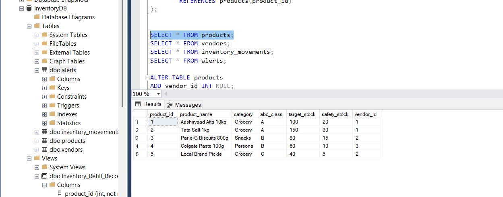
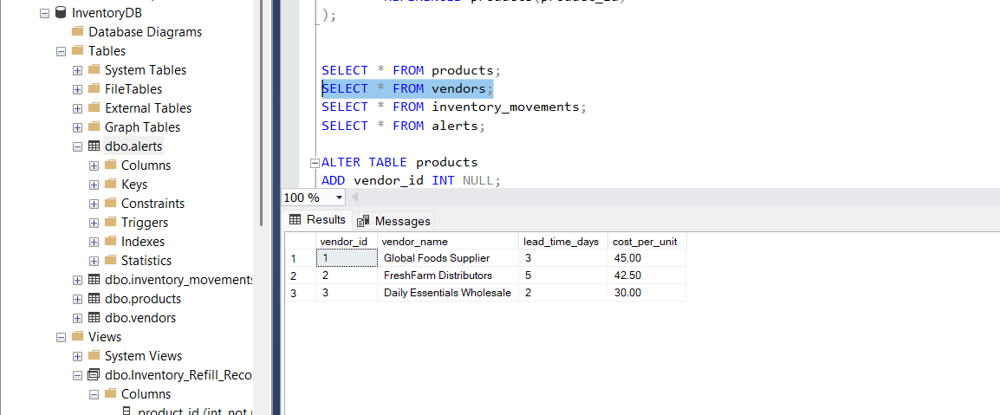
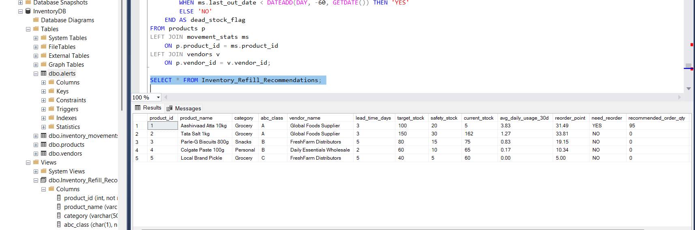
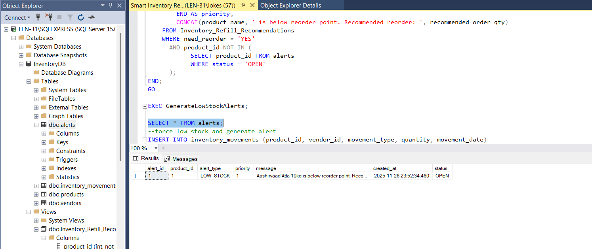
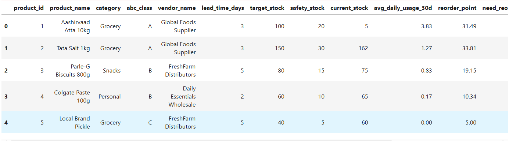
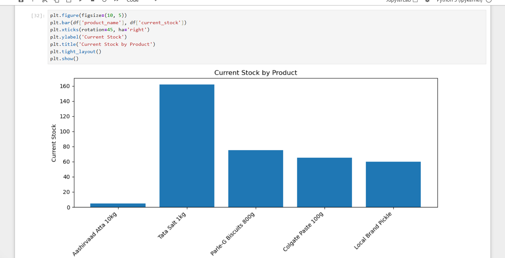
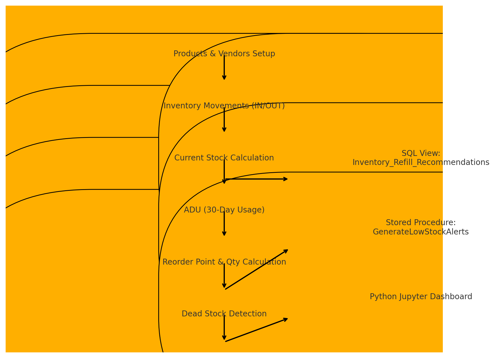

🛒 Smart Inventory Refill & Profit Protection System

A SQL + Python–powered real-time inventory intelligence engine.

🚀 Project Overview

This system is designed to solve real retail challenges like stockouts, dead stock, and poor demand forecasting, commonly faced by supermarkets such as D-Mart, Reliance Smart, and More.

It uses:

SQL Server for inventory logic

Views & Stored Procedures for forecasting & alerts

Python (Jupyter) for dashboards

🗂 Project Folder Structure
smart-inventory-refill-system/
│
├── sql/
│   ├── create_tables.sql
│   ├── insert_sample_data.sql
│   ├── create_view.sql
│   ├── stored_procedure_generate_alerts.sql
│   └── demo_queries.sql
│
├── python/
│   └── inventory_dashboard.ipynb
│
├── docs/
│   ├── Short_Project_Documentation.docx
│   ├── Project_Summary.docx
│   ├── Workflow_Diagram.docx
│   └── Inventory_Refill_Project_Presentation.pptx
│
├── images/
│   ├── Workflow_Diagram.png
│   ├── products_table.png
│   ├── vendors_table.png
│   ├── recommendation_view.png
│   ├── alerts_table.png
│   ├── jupyter_dataframe.png
│   └── stock_chart.png
│
└── README.md

🔍 Key Features
✅ 1. Real-Time Stock Calculation

Tracks all IN/OUT movements and keeps stock updated.

✅ 2. Consumption Forecasting (30-day ADU)
ADU = Total Sales in Last 30 Days / 30

✅ 3. Reorder Recommendation Engine
Reorder Point = (ADU × Lead Time) + Safety Stock

Generates:

need_reorder (YES/NO)

recommended_order_qty

reorder_point

✅ 4. Dead Stock Detection

Flags items with no sales for 60+ days.

✅ 5. Automated Alerts

Stored procedure:

GenerateLowStockAlerts

Creates priority-based alerts using ABC classification.

✅ 6. Python Dashboard

Uses:

pyodbc

pandas

matplotlib

Shows:

Stock chart

Reorder quantities

Dead stock list

🖼 Screenshots (to be uploaded in /images/)

🛠 Tech Stack
Layer	Technology
Database	SQL Server
Logic	SQL Views, Stored Procedures
Dashboard	Jupyter Notebook
Visuals	Matplotlib
Python Libraries	pyodbc, pandas
▶️ How to Run
1. Run SQL Scripts

In this exact order:

create_tables.sql

insert_sample_data.sql

create_view.sql

stored_procedure_generate_alerts.sql

2. Configure Notebook

Inside inventory_dashboard.ipynb, update:

server = r'YOUR_SERVER_NAME'   # Example: localhost\SQLEXPRESS

3. Run All Cells
🔗 Deployment Link (GitHub Codebase)

👉 https://github.com/lokeshbollada/smart-inventory-refill-system

📞 Contact

Lokesh
Email: lokeshbollada80280@gmail.com

⭐ Final Note

This is a complete, end-to-end inventory optimization system built using pure SQL intelligence + Python analytics, structured professionally for technical evaluation.